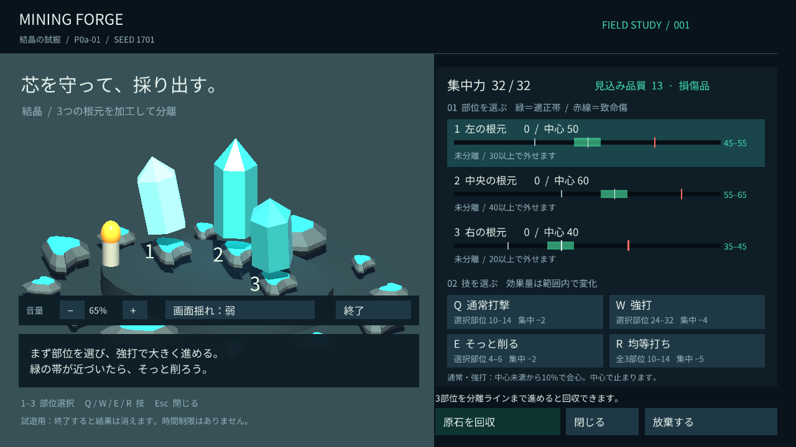
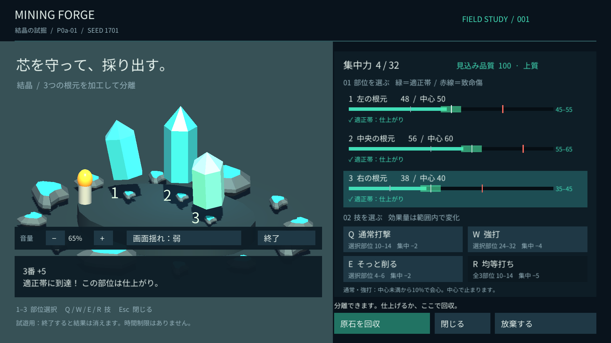
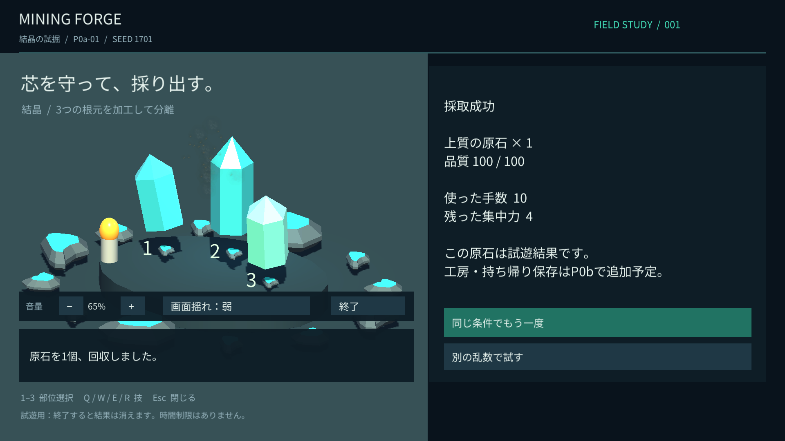

# P0a-01 実行検証

- ゲームソース：`ef89cd0b83b8110507d52109ad0be80d366e3011`
- 実行ファイル：`builds/P0a-01-final/MiningForge.exe`
- Unity 6000.3.18f1 / URP 17.3.0 / Windows x64 / Mono / Direct3D 12
- 検証日：2026-09-06

コミット後に `scripts/build-windows.ps1 -OutputFolder P0a-01-final` で再ビルドし、ゲームフォルダに差分がないことを確認。`--smoke-test` を付けて実際の描画・音声出力を伴う自動試遊を実行。

[自動試遊ログ抜粋](smoke-result.txt)：全チェック合格。非ゼロの音声出力（ピーク0.5695924）。サンプル値の品質100・10手・残り集中力4で回収できた。

日本語の技名・部位表示・回収ボタンをスクリーンショットで確認。クリップを検出した初期版から行の高さと画面クリア処理を修正済み。

| 開始画面 1280×720 | 回収直前 1920×1080 |
| --- | --- |
|  |  |

## ファイル識別

SHA-256：

- `MiningForge.exe`：`5CF8283E7CB3761B6FCBBA8E2C9F36A298A75883CC65CA7719B008F3A7AA231E`
- `MiningForge_Data/Managed/Assembly-CSharp.dll`：`D7C866184E5117C7D7F1B94E7C6C17513A437EA5313A937F5C2CFD86FF76A948`

ビルド全体はGit管理外。ソース・設定・素材・この検証記録をGitHubに保存する。

## 検証の限界

OS入力のエージェントによる一巡は未完了。Computer Useで通常起動と表示を確認したが、ユーザー入力検出後は操作を控えた。自動試遊はUnityのButtonイベントを呼ぶ方式。聴感・気持ちよさ・楽しさは未評価。他PC、長時間、16:9以外は未検証。

最終実行ログにはDXGIのフレーム統計取得に関する警告があり、UnityがCPU時刻へ自動フォールバックした。自動試遊は継続・完了し、C#例外はなかった。環境固有のフレーム時間・滑らかさはユーザーの試遊で確認する。
