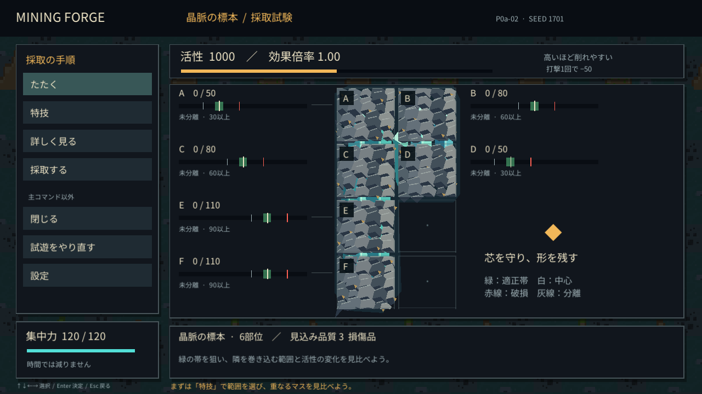
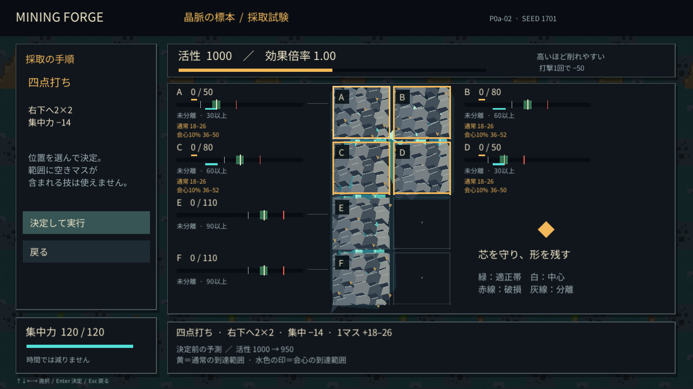
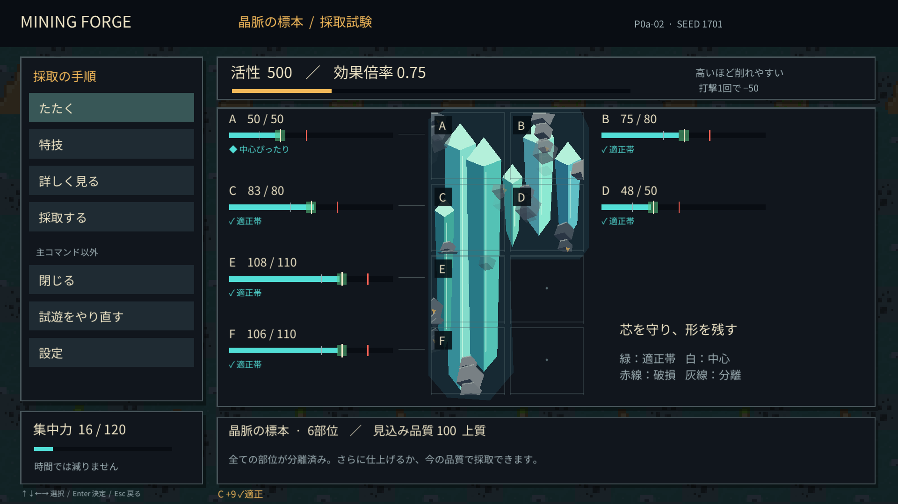
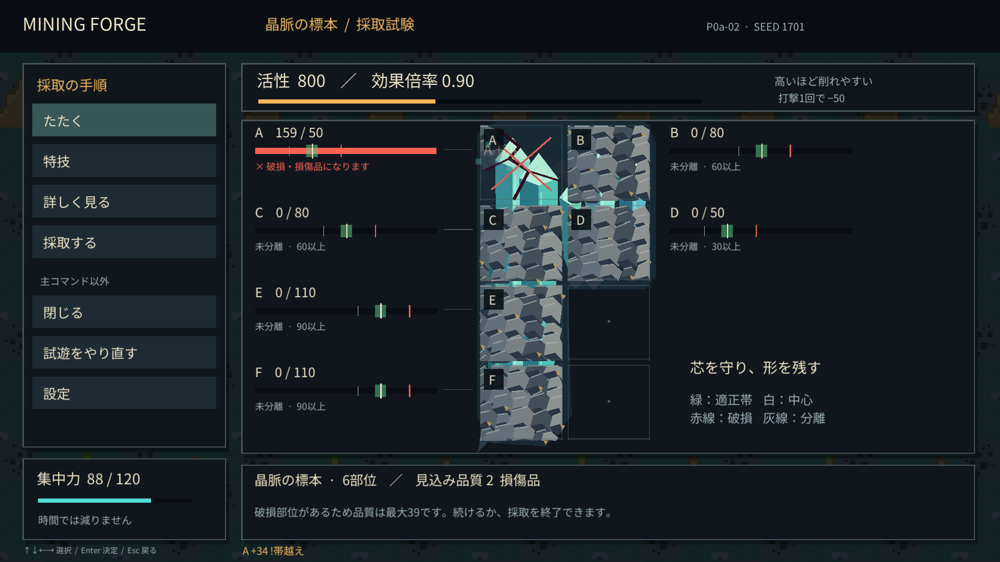

# P0a-02 実行検証

2026-09-06。正式ビルドのゲームソース `e0b2dba42e2f2259f48d4f63d4257ef67c9cd277`。Unity 6000.3.18f1 / URP 17.3.0 / Windows x64 Mono / Direct3D12。

`scripts/build-windows.ps1 -OutputFolder P0a-02-final` でコミット後にビルドし、`SOURCE.txt` の出典とゲームファイルに未コミット変更がないことを確認。実際のWindows実行ファイルを `--smoke-test` で起動し、描画と音声出力を伴う試遊を完了した。

## 確認結果

- [ルールとバランスのログ](rules-and-balance.txt)：新しい盤面の33チェック、旧採取の13,173アサーションが合格。無効範囲、上下限、切り捨て、会心・行優先処理、破損境界と永続フラグ、品質上限、消費不足、回収と二重操作を含む。
- [正式版の自動試遊ログ](smoke-result.txt)：全チェック合格。空き・盤面外拒否、無料の開閉と乱数保持、四点打ち後の活性低下が一度だけ、上下調整、回収、二重回収拒否、無操作の無報酬、局所破損後も続行。seed1701で品質100、17手、集中力16、活性500で原石1個。
- 1280×720／1920×1080の各撮影画面でTextの高さと非黒の描画を機械確認。初期、特技、予測、詳細、露出、結果、局所破損の画像を目視。会心10%の2行目と通常値・ゲージを重ならず表示。
- 音声出力のピーク0.5077321。音量0／揺れなしの設定値も確認。人間による音の心地よさ・聞き分けの評価は未実施。
- OS入力は開発ビルドで、マウスの「特技→四点打ち」、左右矢印の有効／無効位置、Enter実行、Esc中断／復帰を実際に確認。A21/B24/C38/D18、E/F0、集中106、活性950を保持。正式化で変えたのは演出中の次手プレビュー表示の抑制のみで、入力処理は同一。全経路をOS入力だけで一巡したとは扱わない。

## バランス確認

同じ6マス、seed1701〜1720、現在の予測最大値だけを使う簡単な自動手順。どちらも活性を1回上げ、未完成の最大不足マスを最大値が帯上端以内の強打／通常／繊細で仕上げる。範囲併用のみ最初にAの四点2回、Eの縦4回を加える。

| 手順 | 回収 | 上質 | 平均品質 | 平均残り集中 | 平均手数 |
| --- | --- | --- | --- | --- | --- |
| 単体中心＋活性調整 | 20/20 | 20/20 | 100.0 | 22.9 | 15.8 |
| 範囲併用＋活性調整 | 20/20 | 20/20 | 98.4 | 20.6 | 15.2 |

回収不能のseedが多い結果ではないため仮数値は変更しなかった。これは最適戦略やユーザーの使用率ではない。この手順では範囲技の優位は小さく、常用したい技の偏り・鎮静の有用性・温度相当の面白さは次のプレイで確認する。

## 画面

ほかに [特技一覧](01b-skills-1280.png)、[途中評価](03-assessment-1920.png)、[回収結果](05-result-1920.png) を保存。

## 識別と限界

- 起動ファイル：`builds/P0a-02-final/MiningForge.exe`。フォルダ全体が必要。
- `MiningForge.exe` SHA256：`5CF8283E7CB3761B6FCBBA8E2C9F36A298A75883CC65CA7719B008F3A7AA231E`（Unityプレイヤー本体のため旧版と同一。ゲーム内容の識別はDLLとソースを使う）。
- `MiningForge_Data/Managed/Assembly-CSharp.dll` SHA256：`A77BBE0855B5999F14F5B622A0DF552BEA442FE40D14AAED0CF5876547089B8A`。
- D3D12のinfo queue照会が失敗する環境ログあり。描画・試遊は完了し、C#例外なし。音の聴感、他PC、長時間、16:9以外の表示は未検証。
- 素材・ソース・設定・この記録をGitへ保存。ビルド一式、Unity Library、一時ログはGit管理外。ユーザー評価はまだない。
